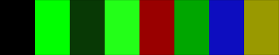
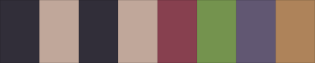

# Default Themes

GoThemeMe includes **452** pre-built themes sourced from [iTerm2-Color-Schemes](https://github.com/mbadolato/iTerm2-Color-Schemes).

## Usage

```go
import "github.com/tj-smith47/gothememe/themes"

// Access by variable
theme := themes.ThemeDracula

// Access by ID
theme := themes.ByID("dracula")

// List all themes
for _, t := range themes.All() {
    fmt.Println(t.ID(), "-", t.DisplayName())
}
```

## Theme List

| Preview | ID | Display Name | Type | Variable |
|---------|----|--------------| ------|----------|
|  | `0x96f` | 0x96f | 🌙 Dark | `themes.ThemeN0x96f` |
|  | `12_bit_rainbow` | 12-bit Rainbow | 🌙 Dark | `themes.ThemeN12BitRainbow` |
|  | `3024_day` | 3024 Day | ☀️ Light | `themes.ThemeN3024Day` |
|  | `3024_night` | 3024 Night | 🌙 Dark | `themes.ThemeN3024Night` |
|  | `aardvark_blue` | Aardvark Blue | 🌙 Dark | `themes.ThemeAardvarkBlue` |
|  | `abernathy` | Abernathy | 🌙 Dark | `themes.ThemeAbernathy` |
|  | `adventure` | Adventure | 🌙 Dark | `themes.ThemeAdventure` |
|  | `adventure_time` | Adventure Time | 🌙 Dark | `themes.ThemeAdventureTime` |
|  | `adwaita` | Adwaita | ☀️ Light | `themes.ThemeAdwaita` |
|  | `adwaita_dark` | Adwaita Dark | 🌙 Dark | `themes.ThemeAdwaitaDark` |
|  | `afterglow` | Afterglow | 🌙 Dark | `themes.ThemeAfterglow` |
|  | `alabaster` | Alabaster | ☀️ Light | `themes.ThemeAlabaster` |
|  | `alien_blood` | Alien Blood | 🌙 Dark | `themes.ThemeAlienBlood` |
|  | `andromeda` | Andromeda | 🌙 Dark | `themes.ThemeAndromeda` |
|  | `apple_classic` | Apple Classic | 🌙 Dark | `themes.ThemeAppleClassic` |
|  | `apple_system_colors` | Apple System Colors | 🌙 Dark | `themes.ThemeAppleSystemColors` |
|  | `apple_system_colors_light` | Apple System Colors Light | ☀️ Light | `themes.ThemeAppleSystemColorsLight` |
|  | `arcoiris` | Arcoiris | 🌙 Dark | `themes.ThemeArcoiris` |
|  | `ardoise` | Ardoise | 🌙 Dark | `themes.ThemeArdoise` |
|  | `argonaut` | Argonaut | 🌙 Dark | `themes.ThemeArgonaut` |
|  | `arthur` | Arthur | 🌙 Dark | `themes.ThemeArthur` |
|  | `atelier_sulphurpool` | Atelier Sulphurpool | 🌙 Dark | `themes.ThemeAtelierSulphurpool` |
|  | `atom` | Atom | 🌙 Dark | `themes.ThemeAtom` |
|  | `atom_one_dark` | Atom One Dark | 🌙 Dark | `themes.ThemeAtomOneDark` |
|  | `atom_one_light` | Atom One Light | ☀️ Light | `themes.ThemeAtomOneLight` |
|  | `aura` | Aura | 🌙 Dark | `themes.ThemeAura` |
|  | `aurora` | Aurora | 🌙 Dark | `themes.ThemeAurora` |
|  | `ayu` | Ayu | 🌙 Dark | `themes.ThemeAyu` |
|  | `ayu_light` | Ayu Light | ☀️ Light | `themes.ThemeAyuLight` |
|  | `ayu_mirage` | Ayu Mirage | 🌙 Dark | `themes.ThemeAyuMirage` |
|  | `banana_blueberry` | Banana Blueberry | 🌙 Dark | `themes.ThemeBananaBlueberry` |
|  | `batman` | Batman | 🌙 Dark | `themes.ThemeBatman` |
|  | `belafonte_day` | Belafonte Day | 🌙 Dark | `themes.ThemeBelafonteDay` |
|  | `belafonte_night` | Belafonte Night | 🌙 Dark | `themes.ThemeBelafonteNight` |
|  | `birds_of_paradise` | Birds Of Paradise | 🌙 Dark | `themes.ThemeBirdsOfParadise` |
|  | `black_metal` | Black Metal | 🌙 Dark | `themes.ThemeBlackMetal` |
|  | `black_metal_bathory` | Black Metal (Bathory) | 🌙 Dark | `themes.ThemeBlackMetalBathory` |
|  | `black_metal_burzum` | Black Metal (Burzum) | 🌙 Dark | `themes.ThemeBlackMetalBurzum` |
|  | `black_metal_dark_funeral` | Black Metal (Dark Funeral) | 🌙 Dark | `themes.ThemeBlackMetalDarkFuneral` |
|  | `black_metal_gorgoroth` | Black Metal (Gorgoroth) | 🌙 Dark | `themes.ThemeBlackMetalGorgoroth` |
|  | `black_metal_immortal` | Black Metal (Immortal) | 🌙 Dark | `themes.ThemeBlackMetalImmortal` |
|  | `black_metal_khold` | Black Metal (Khold) | 🌙 Dark | `themes.ThemeBlackMetalKhold` |
|  | `black_metal_marduk` | Black Metal (Marduk) | 🌙 Dark | `themes.ThemeBlackMetalMarduk` |
|  | `black_metal_mayhem` | Black Metal (Mayhem) | 🌙 Dark | `themes.ThemeBlackMetalMayhem` |
|  | `black_metal_nile` | Black Metal (Nile) | 🌙 Dark | `themes.ThemeBlackMetalNile` |
|  | `black_metal_venom` | Black Metal (Venom) | 🌙 Dark | `themes.ThemeBlackMetalVenom` |
|  | `blazer` | Blazer | 🌙 Dark | `themes.ThemeBlazer` |
|  | `blue_berry_pie` | Blue Berry Pie | 🌙 Dark | `themes.ThemeBlueBerryPie` |
|  | `blue_dolphin` | Blue Dolphin | 🌙 Dark | `themes.ThemeBlueDolphin` |
|  | `blue_matrix` | Blue Matrix | 🌙 Dark | `themes.ThemeBlueMatrix` |
|  | `bluloco_dark` | Bluloco Dark | 🌙 Dark | `themes.ThemeBlulocoDark` |
|  | `bluloco_light` | Bluloco Light | ☀️ Light | `themes.ThemeBlulocoLight` |
|  | `borland` | Borland | 🌙 Dark | `themes.ThemeBorland` |
|  | `box` | Box | 🌙 Dark | `themes.ThemeBox` |
|  | `branch` | branch | 🌙 Dark | `themes.ThemeBranch` |
|  | `breadog` | Breadog | ☀️ Light | `themes.ThemeBreadog` |
|  | `breeze` | Breeze | 🌙 Dark | `themes.ThemeBreeze` |
|  | `bright_lights` | Bright Lights | 🌙 Dark | `themes.ThemeBrightLights` |
|  | `broadcast` | Broadcast | 🌙 Dark | `themes.ThemeBroadcast` |
|  | `brogrammer` | Brogrammer | 🌙 Dark | `themes.ThemeBrogrammer` |
|  | `builtin_dark` | Builtin Dark | 🌙 Dark | `themes.ThemeBuiltinDark` |
|  | `builtin_light` | Builtin Light | ☀️ Light | `themes.ThemeBuiltinLight` |
|  | `builtin_pastel_dark` | Builtin Pastel Dark | 🌙 Dark | `themes.ThemeBuiltinPastelDark` |
|  | `builtin_solarized_dark` | Builtin Solarized Dark | 🌙 Dark | `themes.ThemeBuiltinSolarizedDark` |
|  | `builtin_solarized_light` | Builtin Solarized Light | ☀️ Light | `themes.ThemeBuiltinSolarizedLight` |
|  | `builtin_tango_dark` | Builtin Tango Dark | 🌙 Dark | `themes.ThemeBuiltinTangoDark` |
|  | `builtin_tango_light` | Builtin Tango Light | ☀️ Light | `themes.ThemeBuiltinTangoLight` |
|  | `c64` | C64 | 🌙 Dark | `themes.ThemeC64` |
|  | `calamity` | Calamity | 🌙 Dark | `themes.ThemeCalamity` |
|  | `carbonfox` | Carbonfox | 🌙 Dark | `themes.ThemeCarbonfox` |
|  | `catppuccin_frappe` | Catppuccin Frappe | 🌙 Dark | `themes.ThemeCatppuccinFrappe` |
|  | `catppuccin_latte` | Catppuccin Latte | ☀️ Light | `themes.ThemeCatppuccinLatte` |
|  | `catppuccin_macchiato` | Catppuccin Macchiato | 🌙 Dark | `themes.ThemeCatppuccinMacchiato` |
|  | `catppuccin_mocha` | Catppuccin Mocha | 🌙 Dark | `themes.ThemeCatppuccinMocha` |
|  | `cga` | CGA | 🌙 Dark | `themes.ThemeCga` |
|  | `chalk` | Chalk | 🌙 Dark | `themes.ThemeChalk` |
|  | `chalkboard` | Chalkboard | 🌙 Dark | `themes.ThemeChalkboard` |
|  | `challenger_deep` | Challenger Deep | 🌙 Dark | `themes.ThemeChallengerDeep` |
|  | `chester` | Chester | 🌙 Dark | `themes.ThemeChester` |
|  | `ciapre` | Ciapre | 🌙 Dark | `themes.ThemeCiapre` |
|  | `citruszest` | Citruszest | 🌙 Dark | `themes.ThemeCitruszest` |
|  | `clrs` | CLRS | ☀️ Light | `themes.ThemeClrs` |
|  | `cobalt2` | Cobalt2 | 🌙 Dark | `themes.ThemeCobalt2` |
|  | `cobalt_neon` | Cobalt Neon | 🌙 Dark | `themes.ThemeCobaltNeon` |
|  | `cobalt_next` | Cobalt Next | 🌙 Dark | `themes.ThemeCobaltNext` |
|  | `cobalt_next_dark` | Cobalt Next Dark | 🌙 Dark | `themes.ThemeCobaltNextDark` |
|  | `cobalt_next_minimal` | Cobalt Next Minimal | 🌙 Dark | `themes.ThemeCobaltNextMinimal` |
|  | `coffee_theme` | Coffee Theme | ☀️ Light | `themes.ThemeCoffeeTheme` |
|  | `crayon_pony_fish` | Crayon Pony Fish | 🌙 Dark | `themes.ThemeCrayonPonyFish` |
|  | `cursor_dark` | Cursor Dark | 🌙 Dark | `themes.ThemeCursorDark` |
|  | `cutie_pro` | Cutie Pro | 🌙 Dark | `themes.ThemeCutiePro` |
|  | `cyberdyne` | Cyberdyne | 🌙 Dark | `themes.ThemeCyberdyne` |
|  | `cyberpunk` | Cyberpunk | 🌙 Dark | `themes.ThemeCyberpunk` |
|  | `cyberpunk_scarlet_protocol` | Cyberpunk Scarlet Protocol | 🌙 Dark | `themes.ThemeCyberpunkScarletProtocol` |
|  | `dark` | Dark+ | 🌙 Dark | `themes.ThemeDark` |
|  | `dark_modern` | Dark Modern | 🌙 Dark | `themes.ThemeDarkModern` |
|  | `dark_pastel` | Dark Pastel | 🌙 Dark | `themes.ThemeDarkPastel` |
|  | `darkermatrix` | Darkermatrix | 🌙 Dark | `themes.ThemeDarkermatrix` |
|  | `darkmatrix` | Darkmatrix | 🌙 Dark | `themes.ThemeDarkmatrix` |
|  | `darkside` | Darkside | 🌙 Dark | `themes.ThemeDarkside` |
|  | `dawnfox` | Dawnfox | ☀️ Light | `themes.ThemeDawnfox` |
|  | `dayfox` | Dayfox | ☀️ Light | `themes.ThemeDayfox` |
|  | `deep` | Deep | 🌙 Dark | `themes.ThemeDeep` |
|  | `desert` | Desert | 🌙 Dark | `themes.ThemeDesert` |
|  | `detuned` | Detuned | 🌙 Dark | `themes.ThemeDetuned` |
|  | `dimidium` | Dimidium | 🌙 Dark | `themes.ThemeDimidium` |
|  | `dimmed_monokai` | Dimmed Monokai | 🌙 Dark | `themes.ThemeDimmedMonokai` |
|  | `django` | Django | 🌙 Dark | `themes.ThemeDjango` |
|  | `django_reborn_again` | Django Reborn Again | 🌙 Dark | `themes.ThemeDjangoRebornAgain` |
|  | `django_smooth` | Django Smooth | 🌙 Dark | `themes.ThemeDjangoSmooth` |
|  | `doom_one` | Doom One | 🌙 Dark | `themes.ThemeDoomOne` |
|  | `doom_peacock` | Doom Peacock | 🌙 Dark | `themes.ThemeDoomPeacock` |
|  | `dot_gov` | Dot Gov | 🌙 Dark | `themes.ThemeDotGov` |
|  | `dracula` | Dracula+ | 🌙 Dark | `themes.ThemeDracula` |
|  | `dracula_2` | Dracula | 🌙 Dark | `themes.ThemeDracula2` |
|  | `dracula_pro` | Dracula Pro | 🌙 Dark | `themes.ThemeDraculaPro` |
|  | `duckbones` | Duckbones | 🌙 Dark | `themes.ThemeDuckbones` |
|  | `duotone_dark` | Duotone Dark | 🌙 Dark | `themes.ThemeDuotoneDark` |
|  | `duskfox` | Duskfox | 🌙 Dark | `themes.ThemeDuskfox` |
|  | `earthsong` | Earthsong | 🌙 Dark | `themes.ThemeEarthsong` |
|  | `electron_highlighter` | Electron Highlighter | 🌙 Dark | `themes.ThemeElectronHighlighter` |
|  | `elegant` | Elegant | 🌙 Dark | `themes.ThemeElegant` |
|  | `elemental` | Elemental | 🌙 Dark | `themes.ThemeElemental` |
|  | `elementary` | Elementary | 🌙 Dark | `themes.ThemeElementary` |
|  | `embark` | Embark | 🌙 Dark | `themes.ThemeEmbark` |
|  | `embers_dark` | Embers Dark | 🌙 Dark | `themes.ThemeEmbersDark` |
|  | `encom` | ENCOM | 🌙 Dark | `themes.ThemeEncom` |
|  | `espresso` | Espresso | 🌙 Dark | `themes.ThemeEspresso` |
|  | `espresso_libre` | Espresso Libre | 🌙 Dark | `themes.ThemeEspressoLibre` |
|  | `everblush` | Everblush | 🌙 Dark | `themes.ThemeEverblush` |
|  | `everforest_dark_hard` | Everforest Dark Hard | 🌙 Dark | `themes.ThemeEverforestDarkHard` |
|  | `everforest_light_med` | Everforest Light Med | ☀️ Light | `themes.ThemeEverforestLightMed` |
|  | `fahrenheit` | Fahrenheit | 🌙 Dark | `themes.ThemeFahrenheit` |
|  | `fairyfloss` | Fairyfloss | 🌙 Dark | `themes.ThemeFairyfloss` |
|  | `farmhouse_dark` | Farmhouse Dark | 🌙 Dark | `themes.ThemeFarmhouseDark` |
|  | `farmhouse_light` | Farmhouse Light | ☀️ Light | `themes.ThemeFarmhouseLight` |
|  | `fideloper` | Fideloper | 🌙 Dark | `themes.ThemeFideloper` |
|  | `firefly_traditional` | Firefly Traditional | 🌙 Dark | `themes.ThemeFireflyTraditional` |
|  | `firefox_dev` | Firefox Dev | 🌙 Dark | `themes.ThemeFirefoxDev` |
|  | `firewatch` | Firewatch | 🌙 Dark | `themes.ThemeFirewatch` |
|  | `fish_tank` | Fish Tank | 🌙 Dark | `themes.ThemeFishTank` |
|  | `flat` | Flat | 🌙 Dark | `themes.ThemeFlat` |
|  | `flatland` | Flatland | 🌙 Dark | `themes.ThemeFlatland` |
|  | `flexoki_dark` | Flexoki Dark | 🌙 Dark | `themes.ThemeFlexokiDark` |
|  | `flexoki_light` | Flexoki Light | ☀️ Light | `themes.ThemeFlexokiLight` |
|  | `floraverse` | Floraverse | 🌙 Dark | `themes.ThemeFloraverse` |
|  | `forest_blue` | Forest Blue | 🌙 Dark | `themes.ThemeForestBlue` |
|  | `framer` | Framer | 🌙 Dark | `themes.ThemeFramer` |
|  | `front_end_delight` | Front End Delight | 🌙 Dark | `themes.ThemeFrontEndDelight` |
|  | `fun_forrest` | Fun Forrest | 🌙 Dark | `themes.ThemeFunForrest` |
|  | `galaxy` | Galaxy | 🌙 Dark | `themes.ThemeGalaxy` |
|  | `galizur` | Galizur | 🌙 Dark | `themes.ThemeGalizur` |
|  | `ghostty_default_style_dark` | Ghostty Default Style Dark | 🌙 Dark | `themes.ThemeGhosttyDefaultStyleDark` |
|  | `github` | GitHub | ☀️ Light | `themes.ThemeGithub` |
|  | `github_dark` | GitHub Dark | 🌙 Dark | `themes.ThemeGithubDark` |
|  | `github_dark_colorblind` | GitHub Dark Colorblind | 🌙 Dark | `themes.ThemeGithubDarkColorblind` |
|  | `github_dark_default` | GitHub Dark Default | 🌙 Dark | `themes.ThemeGithubDarkDefault` |
|  | `github_dark_dimmed` | GitHub Dark Dimmed | 🌙 Dark | `themes.ThemeGithubDarkDimmed` |
|  | `github_dark_high_contrast` | GitHub Dark High Contrast | 🌙 Dark | `themes.ThemeGithubDarkHighContrast` |
|  | `github_light_colorblind` | GitHub Light Colorblind | ☀️ Light | `themes.ThemeGithubLightColorblind` |
|  | `github_light_default` | GitHub Light Default | ☀️ Light | `themes.ThemeGithubLightDefault` |
|  | `github_light_high_contrast` | GitHub Light High Contrast | ☀️ Light | `themes.ThemeGithubLightHighContrast` |
|  | `gitlab_dark` | GitLab Dark | 🌙 Dark | `themes.ThemeGitlabDark` |
|  | `gitlab_dark_grey` | GitLab Dark Grey | 🌙 Dark | `themes.ThemeGitlabDarkGrey` |
|  | `gitlab_light` | GitLab Light | ☀️ Light | `themes.ThemeGitlabLight` |
|  | `glacier` | Glacier | 🌙 Dark | `themes.ThemeGlacier` |
|  | `grape` | Grape | 🌙 Dark | `themes.ThemeGrape` |
|  | `grass` | Grass | 🌙 Dark | `themes.ThemeGrass` |
|  | `grey_green` | Grey Green | 🌙 Dark | `themes.ThemeGreyGreen` |
|  | `gruber_darker` | Gruber Darker | 🌙 Dark | `themes.ThemeGruberDarker` |
|  | `gruvbox_dark` | Gruvbox Dark | 🌙 Dark | `themes.ThemeGruvboxDark` |
|  | `gruvbox_dark_hard` | Gruvbox Dark Hard | 🌙 Dark | `themes.ThemeGruvboxDarkHard` |
|  | `gruvbox_light` | Gruvbox Light | ☀️ Light | `themes.ThemeGruvboxLight` |
|  | `gruvbox_light_hard` | Gruvbox Light Hard | ☀️ Light | `themes.ThemeGruvboxLightHard` |
|  | `gruvbox_material` | Gruvbox Material | 🌙 Dark | `themes.ThemeGruvboxMaterial` |
|  | `gruvbox_material_dark` | Gruvbox Material Dark | 🌙 Dark | `themes.ThemeGruvboxMaterialDark` |
|  | `gruvbox_material_light` | Gruvbox Material Light | ☀️ Light | `themes.ThemeGruvboxMaterialLight` |
|  | `guezwhoz` | Guezwhoz | 🌙 Dark | `themes.ThemeGuezwhoz` |
|  | `hacktober` | Hacktober | 🌙 Dark | `themes.ThemeHacktober` |
|  | `hardcore` | Hardcore | 🌙 Dark | `themes.ThemeHardcore` |
|  | `harper` | Harper | 🌙 Dark | `themes.ThemeHarper` |
|  | `havn_daggry` | Havn Daggry | ☀️ Light | `themes.ThemeHavnDaggry` |
|  | `havn_skumring` | Havn Skumring | 🌙 Dark | `themes.ThemeHavnSkumring` |
|  | `hax0r_blue` | HaX0R Blue | 🌙 Dark | `themes.ThemeHax0rBlue` |
|  | `hax0r_gr33n` | HaX0R Gr33N | 🌙 Dark | `themes.ThemeHax0rGr33n` |
|  | `hax0r_r3d` | HaX0R R3D | 🌙 Dark | `themes.ThemeHax0rR3d` |
|  | `heeler` | Heeler | 🌙 Dark | `themes.ThemeHeeler` |
|  | `highway` | Highway | 🌙 Dark | `themes.ThemeHighway` |
|  | `hipster_green` | Hipster Green | 🌙 Dark | `themes.ThemeHipsterGreen` |
|  | `hivacruz` | Hivacruz | 🌙 Dark | `themes.ThemeHivacruz` |
|  | `homebrew` | Homebrew | 🌙 Dark | `themes.ThemeHomebrew` |
|  | `hopscotch` | Hopscotch | 🌙 Dark | `themes.ThemeHopscotch` |
|  | `hopscotch_256` | Hopscotch.256 | 🌙 Dark | `themes.ThemeHopscotch256` |
|  | `horizon` | Horizon | 🌙 Dark | `themes.ThemeHorizon` |
|  | `horizon_bright` | Horizon Bright | ☀️ Light | `themes.ThemeHorizonBright` |
|  | `hot_dog_stand` | Hot Dog Stand | 🌙 Dark | `themes.ThemeHotDogStand` |
|  | `hot_dog_stand_mustard` | Hot Dog Stand (Mustard) | ☀️ Light | `themes.ThemeHotDogStandMustard` |
|  | `hurtado` | Hurtado | 🌙 Dark | `themes.ThemeHurtado` |
|  | `hybrid` | Hybrid | 🌙 Dark | `themes.ThemeHybrid` |
|  | `ibm_5153_cga` | IBM 5153 CGA | 🌙 Dark | `themes.ThemeIbm5153Cga` |
|  | `ibm_5153_cga_black` | IBM 5153 CGA (Black) | 🌙 Dark | `themes.ThemeIbm5153CgaBlack` |
|  | `ic_green_ppl` | IC Green PPL | 🌙 Dark | `themes.ThemeIcGreenPpl` |
|  | `ic_orange_ppl` | IC Orange PPL | 🌙 Dark | `themes.ThemeIcOrangePpl` |
|  | `iceberg_dark` | Iceberg Dark | 🌙 Dark | `themes.ThemeIcebergDark` |
|  | `iceberg_light` | Iceberg Light | ☀️ Light | `themes.ThemeIcebergLight` |
|  | `idea` | Idea | 🌙 Dark | `themes.ThemeIdea` |
|  | `idle_toes` | Idle Toes | 🌙 Dark | `themes.ThemeIdleToes` |
|  | `ir_black` | IR Black | 🌙 Dark | `themes.ThemeIrBlack` |
|  | `irix_console` | IRIX Console | 🌙 Dark | `themes.ThemeIrixConsole` |
|  | `irix_terminal` | IRIX Terminal | 🌙 Dark | `themes.ThemeIrixTerminal` |
|  | `iterm2_dark_background` | iTerm2 Dark Background | 🌙 Dark | `themes.ThemeIterm2DarkBackground` |
|  | `iterm2_default` | iTerm2 Default | 🌙 Dark | `themes.ThemeIterm2Default` |
|  | `iterm2_light_background` | iTerm2 Light Background | ☀️ Light | `themes.ThemeIterm2LightBackground` |
|  | `iterm2_pastel_dark_background` | iTerm2 Pastel Dark Background | 🌙 Dark | `themes.ThemeIterm2PastelDarkBackground` |
|  | `iterm2_smoooooth` | iTerm2 Smoooooth | 🌙 Dark | `themes.ThemeIterm2Smoooooth` |
|  | `iterm2_solarized_dark` | iTerm2 Solarized Dark | 🌙 Dark | `themes.ThemeIterm2SolarizedDark` |
|  | `iterm2_solarized_light` | iTerm2 Solarized Light | ☀️ Light | `themes.ThemeIterm2SolarizedLight` |
|  | `iterm2_tango_dark` | iTerm2 Tango Dark | 🌙 Dark | `themes.ThemeIterm2TangoDark` |
|  | `iterm2_tango_light` | iTerm2 Tango Light | ☀️ Light | `themes.ThemeIterm2TangoLight` |
|  | `jackie_brown` | Jackie Brown | 🌙 Dark | `themes.ThemeJackieBrown` |
|  | `japanesque` | Japanesque | 🌙 Dark | `themes.ThemeJapanesque` |
|  | `jellybeans` | Jellybeans | 🌙 Dark | `themes.ThemeJellybeans` |
|  | `jetbrains_darcula` | JetBrains Darcula | 🌙 Dark | `themes.ThemeJetbrainsDarcula` |
|  | `jubi` | Jubi | 🌙 Dark | `themes.ThemeJubi` |
|  | `kanagawa_dragon` | Kanagawa Dragon | 🌙 Dark | `themes.ThemeKanagawaDragon` |
|  | `kanagawa_wave` | Kanagawa Wave | 🌙 Dark | `themes.ThemeKanagawaWave` |
|  | `kanagawabones` | Kanagawabones | 🌙 Dark | `themes.ThemeKanagawabones` |
|  | `kibble` | Kibble | 🌙 Dark | `themes.ThemeKibble` |
|  | `kitty_default` | Kitty Default | 🌙 Dark | `themes.ThemeKittyDefault` |
|  | `kitty_low_contrast` | Kitty Low Contrast | 🌙 Dark | `themes.ThemeKittyLowContrast` |
|  | `kolorit` | Kolorit | 🌙 Dark | `themes.ThemeKolorit` |
|  | `konsolas` | Konsolas | 🌙 Dark | `themes.ThemeKonsolas` |
|  | `kurokula` | Kurokula | 🌙 Dark | `themes.ThemeKurokula` |
|  | `lab_fox` | Lab Fox | 🌙 Dark | `themes.ThemeLabFox` |
|  | `laser` | Laser | 🌙 Dark | `themes.ThemeLaser` |
|  | `later_this_evening` | Later This Evening | 🌙 Dark | `themes.ThemeLaterThisEvening` |
|  | `lavandula` | Lavandula | 🌙 Dark | `themes.ThemeLavandula` |
|  | `light_owl` | Light Owl | ☀️ Light | `themes.ThemeLightOwl` |
|  | `liquid_carbon` | Liquid Carbon | 🌙 Dark | `themes.ThemeLiquidCarbon` |
|  | `liquid_carbon_transparent` | Liquid Carbon Transparent | 🌙 Dark | `themes.ThemeLiquidCarbonTransparent` |
|  | `lovelace` | Lovelace | 🌙 Dark | `themes.ThemeLovelace` |
|  | `man_page` | Man Page | ☀️ Light | `themes.ThemeManPage` |
|  | `mariana` | Mariana | 🌙 Dark | `themes.ThemeMariana` |
|  | `material` | Material | ☀️ Light | `themes.ThemeMaterial` |
|  | `material_dark` | Material Dark | 🌙 Dark | `themes.ThemeMaterialDark` |
|  | `material_darker` | Material Darker | 🌙 Dark | `themes.ThemeMaterialDarker` |
|  | `material_design_colors` | Material Design Colors | 🌙 Dark | `themes.ThemeMaterialDesignColors` |
|  | `material_ocean` | Material Ocean | 🌙 Dark | `themes.ThemeMaterialOcean` |
|  | `mathias` | Mathias | 🌙 Dark | `themes.ThemeMathias` |
|  | `matrix` | Matrix | 🌙 Dark | `themes.ThemeMatrix` |
|  | `matte_black` | Matte Black | 🌙 Dark | `themes.ThemeMatteBlack` |
|  | `medallion` | Medallion | 🌙 Dark | `themes.ThemeMedallion` |
|  | `melange_dark` | Melange Dark | 🌙 Dark | `themes.ThemeMelangeDark` |
|  | `melange_light` | Melange Light | ☀️ Light | `themes.ThemeMelangeLight` |
|  | `mellifluous` | Mellifluous | 🌙 Dark | `themes.ThemeMellifluous` |
|  | `mellow` | Mellow | 🌙 Dark | `themes.ThemeMellow` |
|  | `miasma` | Miasma | 🌙 Dark | `themes.ThemeMiasma` |
|  | `midnight_in_mojave` | Midnight In Mojave | 🌙 Dark | `themes.ThemeMidnightInMojave` |
|  | `mirage` | Mirage | 🌙 Dark | `themes.ThemeMirage` |
|  | `misterioso` | Misterioso | 🌙 Dark | `themes.ThemeMisterioso` |
|  | `molokai` | Molokai | 🌙 Dark | `themes.ThemeMolokai` |
|  | `mona_lisa` | Mona Lisa | 🌙 Dark | `themes.ThemeMonaLisa` |
|  | `monokai_classic` | Monokai Classic | 🌙 Dark | `themes.ThemeMonokaiClassic` |
|  | `monokai_pro` | Monokai Pro | 🌙 Dark | `themes.ThemeMonokaiPro` |
|  | `monokai_pro_light` | Monokai Pro Light | ☀️ Light | `themes.ThemeMonokaiProLight` |
|  | `monokai_pro_light_sun` | Monokai Pro Light Sun | ☀️ Light | `themes.ThemeMonokaiProLightSun` |
|  | `monokai_pro_machine` | Monokai Pro Machine | 🌙 Dark | `themes.ThemeMonokaiProMachine` |
|  | `monokai_pro_octagon` | Monokai Pro Octagon | 🌙 Dark | `themes.ThemeMonokaiProOctagon` |
|  | `monokai_pro_ristretto` | Monokai Pro Ristretto | 🌙 Dark | `themes.ThemeMonokaiProRistretto` |
|  | `monokai_pro_spectrum` | Monokai Pro Spectrum | 🌙 Dark | `themes.ThemeMonokaiProSpectrum` |
|  | `monokai_remastered` | Monokai Remastered | 🌙 Dark | `themes.ThemeMonokaiRemastered` |
|  | `monokai_soda` | Monokai Soda | 🌙 Dark | `themes.ThemeMonokaiSoda` |
|  | `monokai_vivid` | Monokai Vivid | 🌙 Dark | `themes.ThemeMonokaiVivid` |
|  | `moonfly` | Moonfly | 🌙 Dark | `themes.ThemeMoonfly` |
|  | `n0tch2k` | N0Tch2K | 🌙 Dark | `themes.ThemeN0tch2k` |
|  | `neobones_dark` | Neobones Dark | 🌙 Dark | `themes.ThemeNeobonesDark` |
|  | `neobones_light` | Neobones Light | ☀️ Light | `themes.ThemeNeobonesLight` |
|  | `neon` | Neon | 🌙 Dark | `themes.ThemeNeon` |
|  | `neopolitan` | Neopolitan | 🌙 Dark | `themes.ThemeNeopolitan` |
|  | `neutron` | Neutron | 🌙 Dark | `themes.ThemeNeutron` |
|  | `night_lion_v1` | Night Lion V1 | 🌙 Dark | `themes.ThemeNightLionV1` |
|  | `night_lion_v2` | Night Lion V2 | 🌙 Dark | `themes.ThemeNightLionV2` |
|  | `night_owl` | Night Owl | 🌙 Dark | `themes.ThemeNightOwl` |
|  | `night_owlish_light` | Night Owlish Light | ☀️ Light | `themes.ThemeNightOwlishLight` |
|  | `nightfox` | Nightfox | 🌙 Dark | `themes.ThemeNightfox` |
|  | `niji` | Niji | 🌙 Dark | `themes.ThemeNiji` |
|  | `no_clown_fiesta` | No Clown Fiesta | 🌙 Dark | `themes.ThemeNoClownFiesta` |
|  | `no_clown_fiesta_light` | No Clown Fiesta Light | 🌙 Dark | `themes.ThemeNoClownFiestaLight` |
|  | `nocturnal_winter` | Nocturnal Winter | 🌙 Dark | `themes.ThemeNocturnalWinter` |
|  | `nord` | Nord | 🌙 Dark | `themes.ThemeNord` |
|  | `nord_light` | Nord Light | ☀️ Light | `themes.ThemeNordLight` |
|  | `nord_wave` | Nord Wave | 🌙 Dark | `themes.ThemeNordWave` |
|  | `nordfox` | Nordfox | 🌙 Dark | `themes.ThemeNordfox` |
|  | `novel` | Novel | 🌙 Dark | `themes.ThemeNovel` |
|  | `novmbr` | novmbr | 🌙 Dark | `themes.ThemeNovmbr` |
|  | `nvim_dark` | Nvim Dark | 🌙 Dark | `themes.ThemeNvimDark` |
|  | `nvim_light` | Nvim Light | ☀️ Light | `themes.ThemeNvimLight` |
|  | `obsidian` | Obsidian | 🌙 Dark | `themes.ThemeObsidian` |
|  | `ocean` | Ocean | 🌙 Dark | `themes.ThemeOcean` |
|  | `oceanic_material` | Oceanic Material | 🌙 Dark | `themes.ThemeOceanicMaterial` |
|  | `oceanic_next` | Oceanic Next | 🌙 Dark | `themes.ThemeOceanicNext` |
|  | `ollie` | Ollie | 🌙 Dark | `themes.ThemeOllie` |
|  | `one_dark_two` | One Dark Two | 🌙 Dark | `themes.ThemeOneDarkTwo` |
|  | `one_double_dark` | One Double Dark | 🌙 Dark | `themes.ThemeOneDoubleDark` |
|  | `one_double_light` | One Double Light | ☀️ Light | `themes.ThemeOneDoubleLight` |
|  | `one_half_dark` | One Half Dark | 🌙 Dark | `themes.ThemeOneHalfDark` |
|  | `one_half_light` | One Half Light | ☀️ Light | `themes.ThemeOneHalfLight` |
|  | `operator_mono_dark` | Operator Mono Dark | 🌙 Dark | `themes.ThemeOperatorMonoDark` |
|  | `overnight_slumber` | Overnight Slumber | 🌙 Dark | `themes.ThemeOvernightSlumber` |
|  | `owl` | owl | 🌙 Dark | `themes.ThemeOwl` |
|  | `oxocarbon` | Oxocarbon | 🌙 Dark | `themes.ThemeOxocarbon` |
|  | `pale_night_hc` | Pale Night Hc | 🌙 Dark | `themes.ThemePaleNightHc` |
|  | `pandora` | Pandora | 🌙 Dark | `themes.ThemePandora` |
|  | `paraiso_dark` | Paraiso Dark | 🌙 Dark | `themes.ThemeParaisoDark` |
|  | `paul_millr` | Paul Millr | 🌙 Dark | `themes.ThemePaulMillr` |
|  | `pencil_dark` | Pencil Dark | 🌙 Dark | `themes.ThemePencilDark` |
|  | `pencil_light` | Pencil Light | ☀️ Light | `themes.ThemePencilLight` |
|  | `peppermint` | Peppermint | 🌙 Dark | `themes.ThemePeppermint` |
|  | `phala_green_dark` | Phala Green Dark | 🌙 Dark | `themes.ThemePhalaGreenDark` |
|  | `piatto_light` | Piatto Light | ☀️ Light | `themes.ThemePiattoLight` |
|  | `pnevma` | Pnevma | 🌙 Dark | `themes.ThemePnevma` |
|  | `poimandres` | Poimandres | 🌙 Dark | `themes.ThemePoimandres` |
|  | `poimandres_darker` | Poimandres Darker | 🌙 Dark | `themes.ThemePoimandresDarker` |
|  | `poimandres_storm` | Poimandres Storm | 🌙 Dark | `themes.ThemePoimandresStorm` |
|  | `poimandres_white` | Poimandres White | ☀️ Light | `themes.ThemePoimandresWhite` |
|  | `popping_and_locking` | Popping And Locking | 🌙 Dark | `themes.ThemePoppingAndLocking` |
|  | `powershell` | Powershell | 🌙 Dark | `themes.ThemePowershell` |
|  | `primary` | Primary | ☀️ Light | `themes.ThemePrimary` |
|  | `pro` | Pro | 🌙 Dark | `themes.ThemePro` |
|  | `pro_light` | Pro Light | ☀️ Light | `themes.ThemeProLight` |
|  | `purple_rain` | Purple Rain | 🌙 Dark | `themes.ThemePurpleRain` |
|  | `purplepeter` | Purplepeter | 🌙 Dark | `themes.ThemePurplepeter` |
|  | `rapture` | Rapture | 🌙 Dark | `themes.ThemeRapture` |
|  | `raycast_dark` | Raycast Dark | 🌙 Dark | `themes.ThemeRaycastDark` |
|  | `raycast_light` | Raycast Light | ☀️ Light | `themes.ThemeRaycastLight` |
|  | `rebecca` | Rebecca | 🌙 Dark | `themes.ThemeRebecca` |
|  | `red_alert` | Red Alert | 🌙 Dark | `themes.ThemeRedAlert` |
|  | `red_planet` | Red Planet | 🌙 Dark | `themes.ThemeRedPlanet` |
|  | `red_sands` | Red Sands | 🌙 Dark | `themes.ThemeRedSands` |
|  | `relaxed` | Relaxed | 🌙 Dark | `themes.ThemeRelaxed` |
|  | `retro` | Retro | 🌙 Dark | `themes.ThemeRetro` |
|  | `retro_legends` | Retro Legends | 🌙 Dark | `themes.ThemeRetroLegends` |
|  | `rippedcasts` | Rippedcasts | 🌙 Dark | `themes.ThemeRippedcasts` |
|  | `rose_pine` | Rose Pine | 🌙 Dark | `themes.ThemeRosePine` |
|  | `rose_pine_dawn` | Rose Pine Dawn | ☀️ Light | `themes.ThemeRosePineDawn` |
|  | `rose_pine_moon` | Rose Pine Moon | 🌙 Dark | `themes.ThemeRosePineMoon` |
|  | `rouge_2` | Rouge 2 | 🌙 Dark | `themes.ThemeRouge2` |
|  | `royal` | Royal | 🌙 Dark | `themes.ThemeRoyal` |
|  | `ryuuko` | Ryuuko | 🌙 Dark | `themes.ThemeRyuuko` |
|  | `sakura` | Sakura | 🌙 Dark | `themes.ThemeSakura` |
|  | `scarlet_protocol` | Scarlet Protocol | 🌙 Dark | `themes.ThemeScarletProtocol` |
|  | `sea_shells` | Sea Shells | 🌙 Dark | `themes.ThemeSeaShells` |
|  | `seafoam_pastel` | Seafoam Pastel | 🌙 Dark | `themes.ThemeSeafoamPastel` |
|  | `selenized_black` | Selenized Black | 🌙 Dark | `themes.ThemeSelenizedBlack` |
|  | `selenized_dark` | Selenized Dark | 🌙 Dark | `themes.ThemeSelenizedDark` |
|  | `selenized_light` | Selenized Light | ☀️ Light | `themes.ThemeSelenizedLight` |
|  | `seoulbones_dark` | Seoulbones Dark | 🌙 Dark | `themes.ThemeSeoulbonesDark` |
|  | `seoulbones_light` | Seoulbones Light | ☀️ Light | `themes.ThemeSeoulbonesLight` |
|  | `seti` | Seti | 🌙 Dark | `themes.ThemeSeti` |
|  | `shades_of_purple` | Shades Of Purple | 🌙 Dark | `themes.ThemeShadesOfPurple` |
|  | `shaman` | Shaman | 🌙 Dark | `themes.ThemeShaman` |
|  | `slate` | Slate | 🌙 Dark | `themes.ThemeSlate` |
|  | `sleepy_hollow` | Sleepy Hollow | 🌙 Dark | `themes.ThemeSleepyHollow` |
|  | `smyck` | Smyck | 🌙 Dark | `themes.ThemeSmyck` |
|  | `snazzy` | Snazzy | 🌙 Dark | `themes.ThemeSnazzy` |
|  | `snazzy_soft` | Snazzy Soft | 🌙 Dark | `themes.ThemeSnazzySoft` |
|  | `soft_server` | Soft Server | 🌙 Dark | `themes.ThemeSoftServer` |
|  | `solarized_darcula` | Solarized Darcula | 🌙 Dark | `themes.ThemeSolarizedDarcula` |
|  | `solarized_dark_higher_contrast` | Solarized Dark Higher Contrast | 🌙 Dark | `themes.ThemeSolarizedDarkHigherContrast` |
|  | `solarized_dark_patched` | Solarized Dark Patched | 🌙 Dark | `themes.ThemeSolarizedDarkPatched` |
|  | `solarized_osaka_night` | Solarized Osaka Night | 🌙 Dark | `themes.ThemeSolarizedOsakaNight` |
|  | `sonokai` | Sonokai | 🌙 Dark | `themes.ThemeSonokai` |
|  | `spacedust` | Spacedust | 🌙 Dark | `themes.ThemeSpacedust` |
|  | `spacegray` | Spacegray | 🌙 Dark | `themes.ThemeSpacegray` |
|  | `spacegray_bright` | Spacegray Bright | 🌙 Dark | `themes.ThemeSpacegrayBright` |
|  | `spacegray_eighties` | Spacegray Eighties | 🌙 Dark | `themes.ThemeSpacegrayEighties` |
|  | `spacegray_eighties_dull` | Spacegray Eighties Dull | 🌙 Dark | `themes.ThemeSpacegrayEightiesDull` |
|  | `spiderman` | Spiderman | 🌙 Dark | `themes.ThemeSpiderman` |
|  | `spring` | Spring | ☀️ Light | `themes.ThemeSpring` |
|  | `square` | Square | 🌙 Dark | `themes.ThemeSquare` |
|  | `squirrelsong_dark` | Squirrelsong Dark | 🌙 Dark | `themes.ThemeSquirrelsongDark` |
|  | `srcery` | Srcery | 🌙 Dark | `themes.ThemeSrcery` |
|  | `starlight` | Starlight | 🌙 Dark | `themes.ThemeStarlight` |
|  | `sublette` | Sublette | 🌙 Dark | `themes.ThemeSublette` |
|  | `subliminal` | Subliminal | 🌙 Dark | `themes.ThemeSubliminal` |
|  | `sugarplum` | Sugarplum | 🌙 Dark | `themes.ThemeSugarplum` |
|  | `sundried` | Sundried | 🌙 Dark | `themes.ThemeSundried` |
|  | `symfonic` | Symfonic | 🌙 Dark | `themes.ThemeSymfonic` |
|  | `synthwave` | Synthwave | 🌙 Dark | `themes.ThemeSynthwave` |
|  | `synthwave_alpha` | Synthwave Alpha | 🌙 Dark | `themes.ThemeSynthwaveAlpha` |
|  | `synthwave_everything` | Synthwave Everything | 🌙 Dark | `themes.ThemeSynthwaveEverything` |
|  | `tango_adapted` | Tango Adapted | ☀️ Light | `themes.ThemeTangoAdapted` |
|  | `tango_half_adapted` | Tango Half Adapted | ☀️ Light | `themes.ThemeTangoHalfAdapted` |
|  | `tearout` | Tearout | 🌙 Dark | `themes.ThemeTearout` |
|  | `teerb` | Teerb | 🌙 Dark | `themes.ThemeTeerb` |
|  | `terafox` | Terafox | 🌙 Dark | `themes.ThemeTerafox` |
|  | `terminal_basic` | Terminal Basic | ☀️ Light | `themes.ThemeTerminalBasic` |
|  | `terminal_basic_dark` | Terminal Basic Dark | 🌙 Dark | `themes.ThemeTerminalBasicDark` |
|  | `thayer_bright` | Thayer Bright | 🌙 Dark | `themes.ThemeThayerBright` |
|  | `the_hulk` | The Hulk | 🌙 Dark | `themes.ThemeTheHulk` |
|  | `tinacious_design_dark` | Tinacious Design Dark | 🌙 Dark | `themes.ThemeTinaciousDesignDark` |
|  | `tinacious_design_light` | Tinacious Design Light | ☀️ Light | `themes.ThemeTinaciousDesignLight` |
|  | `tokyonight` | TokyoNight | 🌙 Dark | `themes.ThemeTokyonight` |
|  | `tokyonight_day` | TokyoNight Day | ☀️ Light | `themes.ThemeTokyonightDay` |
|  | `tokyonight_moon` | TokyoNight Moon | 🌙 Dark | `themes.ThemeTokyonightMoon` |
|  | `tokyonight_night` | TokyoNight Night | 🌙 Dark | `themes.ThemeTokyonightNight` |
|  | `tokyonight_storm` | TokyoNight Storm | 🌙 Dark | `themes.ThemeTokyonightStorm` |
|  | `tomorrow` | Tomorrow | ☀️ Light | `themes.ThemeTomorrow` |
|  | `tomorrow_night` | Tomorrow Night | 🌙 Dark | `themes.ThemeTomorrowNight` |
|  | `tomorrow_night_blue` | Tomorrow Night Blue | 🌙 Dark | `themes.ThemeTomorrowNightBlue` |
|  | `tomorrow_night_bright` | Tomorrow Night Bright | 🌙 Dark | `themes.ThemeTomorrowNightBright` |
|  | `tomorrow_night_burns` | Tomorrow Night Burns | 🌙 Dark | `themes.ThemeTomorrowNightBurns` |
|  | `tomorrow_night_eighties` | Tomorrow Night Eighties | 🌙 Dark | `themes.ThemeTomorrowNightEighties` |
|  | `toy_chest` | Toy Chest | 🌙 Dark | `themes.ThemeToyChest` |
|  | `traffic` | traffic | 🌙 Dark | `themes.ThemeTraffic` |
|  | `treehouse` | Treehouse | 🌙 Dark | `themes.ThemeTreehouse` |
|  | `twilight` | Twilight | 🌙 Dark | `themes.ThemeTwilight` |
|  | `ubuntu` | Ubuntu | 🌙 Dark | `themes.ThemeUbuntu` |
|  | `ultra_dark` | Ultra Dark | 🌙 Dark | `themes.ThemeUltraDark` |
|  | `ultra_violent` | Ultra Violent | 🌙 Dark | `themes.ThemeUltraViolent` |
|  | `under_the_sea` | Under The Sea | 🌙 Dark | `themes.ThemeUnderTheSea` |
|  | `unikitty` | Unikitty | 🌙 Dark | `themes.ThemeUnikitty` |
|  | `urban` | urban | 🌙 Dark | `themes.ThemeUrban` |
|  | `urple` | Urple | 🌙 Dark | `themes.ThemeUrple` |
|  | `vague` | Vague | 🌙 Dark | `themes.ThemeVague` |
|  | `vaughn` | Vaughn | 🌙 Dark | `themes.ThemeVaughn` |
|  | `vercel` | Vercel | 🌙 Dark | `themes.ThemeVercel` |
|  | `vesper` | Vesper | 🌙 Dark | `themes.ThemeVesper` |
|  | `vibrant_ink` | Vibrant Ink | 🌙 Dark | `themes.ThemeVibrantInk` |
|  | `vimbones` | Vimbones | ☀️ Light | `themes.ThemeVimbones` |
|  | `violet_dark` | Violet Dark | 🌙 Dark | `themes.ThemeVioletDark` |
|  | `violet_light` | Violet Light | ☀️ Light | `themes.ThemeVioletLight` |
|  | `violite` | Violite | 🌙 Dark | `themes.ThemeViolite` |
|  | `warm_neon` | Warm Neon | 🌙 Dark | `themes.ThemeWarmNeon` |
|  | `wez` | Wez | 🌙 Dark | `themes.ThemeWez` |
|  | `whimsy` | Whimsy | 🌙 Dark | `themes.ThemeWhimsy` |
|  | `wild_cherry` | Wild Cherry | 🌙 Dark | `themes.ThemeWildCherry` |
|  | `wilmersdorf` | Wilmersdorf | 🌙 Dark | `themes.ThemeWilmersdorf` |
|  | `wombat` | Wombat | 🌙 Dark | `themes.ThemeWombat` |
|  | `wryan` | Wryan | 🌙 Dark | `themes.ThemeWryan` |
|  | `xcode_dark` | Xcode Dark | 🌙 Dark | `themes.ThemeXcodeDark` |
|  | `xcode_dark_hc` | Xcode Dark hc | 🌙 Dark | `themes.ThemeXcodeDarkHc` |
|  | `xcode_light` | Xcode Light | ☀️ Light | `themes.ThemeXcodeLight` |
|  | `xcode_light_hc` | Xcode Light hc | ☀️ Light | `themes.ThemeXcodeLightHc` |
|  | `xcode_wwdc` | Xcode WWDC | 🌙 Dark | `themes.ThemeXcodeWwdc` |
|  | `zenbones` | Zenbones | ☀️ Light | `themes.ThemeZenbones` |
|  | `zenbones_dark` | Zenbones Dark | 🌙 Dark | `themes.ThemeZenbonesDark` |
|  | `zenbones_light` | Zenbones Light | ☀️ Light | `themes.ThemeZenbonesLight` |
|  | `zenburn` | Zenburn | 🌙 Dark | `themes.ThemeZenburn` |
|  | `zenburned` | Zenburned | 🌙 Dark | `themes.ThemeZenburned` |
|  | `zenwritten_dark` | Zenwritten Dark | 🌙 Dark | `themes.ThemeZenwrittenDark` |
|  | `zenwritten_light` | Zenwritten Light | ☀️ Light | `themes.ThemeZenwrittenLight` |

## Popular Themes

### Dark Themes
- **Dracula** - A dark theme with purple accents
- **Nord** - An arctic, north-bluish color palette
- **Gruvbox Dark** - Retro groove color scheme
- **Tokyo Night** - A dark theme inspired by Tokyo
- **Catppuccin Mocha** - Soothing pastel theme
- **One Dark** - Atom's iconic dark theme
- **Monokai** - Classic syntax highlighting theme

### Light Themes
- **Solarized Light** - Precision colors for light backgrounds
- **Gruvbox Light** - Retro groove for light mode
- **Catppuccin Latte** - Catppuccin's light variant
- **One Light** - Atom's light companion theme

## Adding Custom Themes

See the [Contributing Guide](docs/CONTRIBUTING.md) for instructions on adding new themes.
